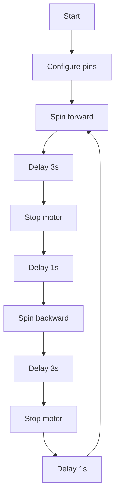

# 6A H-Bridge Motor Control with Arduino

This project demonstrates how to control a DC motor using a 6A H-bridge and an Arduino, allowing direction reversal and speed control through PWM.

## Requirements
- Arduino (Uno, Nano or similar)
- 6A H-bridge driver
- Compatible DC motor
- Power supply suitable for the motor
- Jumper wires and prototyping components

## Connections

| Component | Arduino Pin | Description |
|-----------|-------------|-------------|
| IN1       | 8           | Direction input 1 |
| IN2       | 9           | Direction input 2 |
| ENA (PWM) | 10          | Motor enable / Speed control |
| Vcc       | 5V          | Logic supply |
| GND       | GND         | Ground reference |

Motor power must be connected directly to the H-bridge, respecting the motor's current rating.

## Usage
1. Connect the components according to the table above.
2. Upload `Code/HBridgeControl.ino` to your Arduino.
3. (Optional) Open the Serial Monitor for debugging.
4. The motor will alternate between forward and reverse rotations with programmed pauses.

## Safety
- Use appropriate fuses to protect against short circuits.
- Avoid touching the H-bridge or motor while powered.
- Ensure the power supply can handle the motor's current draw.

## Flowchart

## License
This project is licensed under the MIT License.

